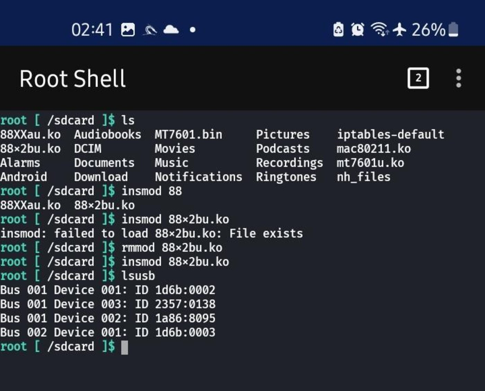
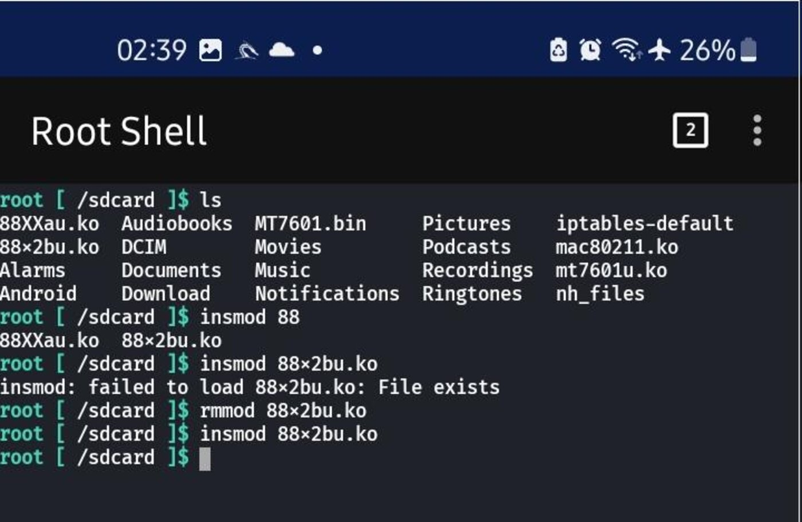
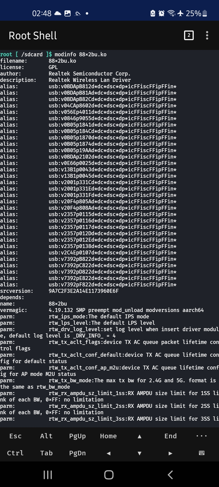
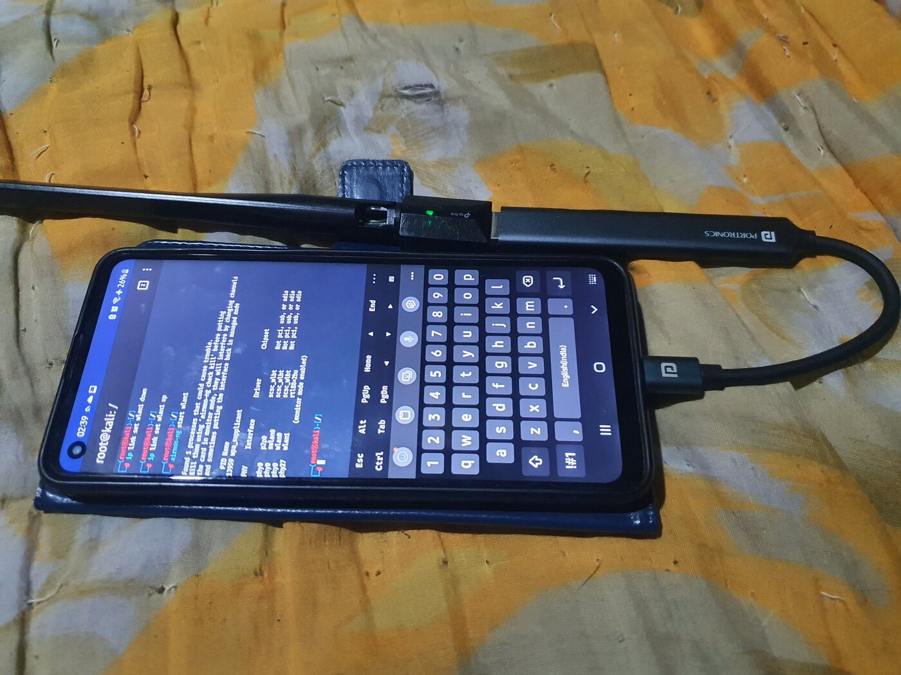
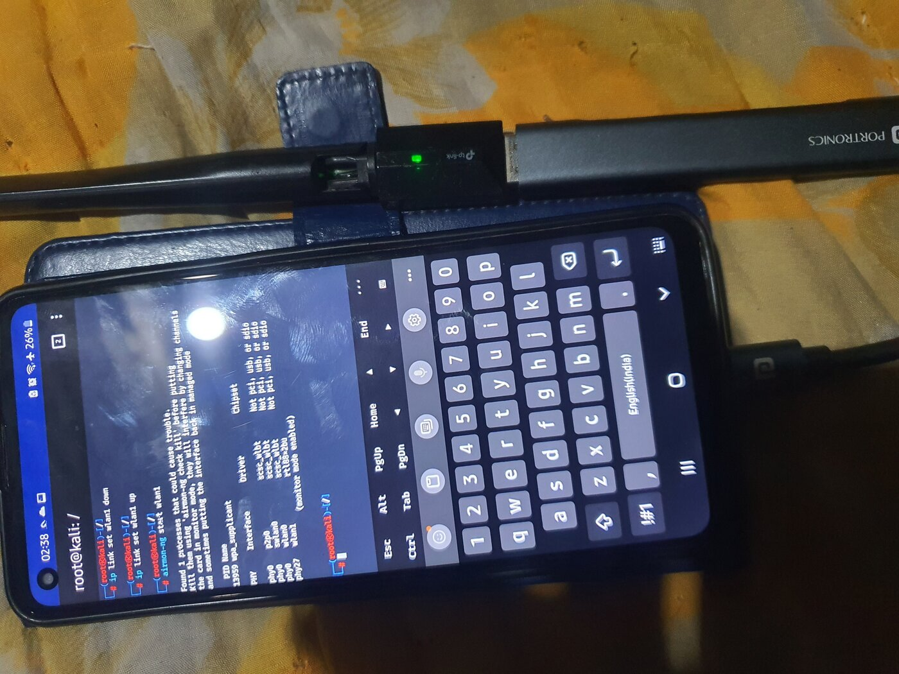
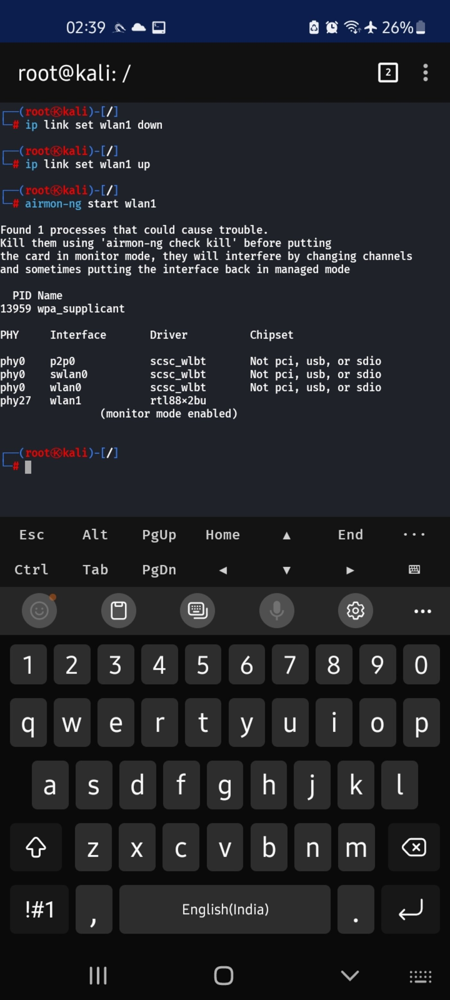
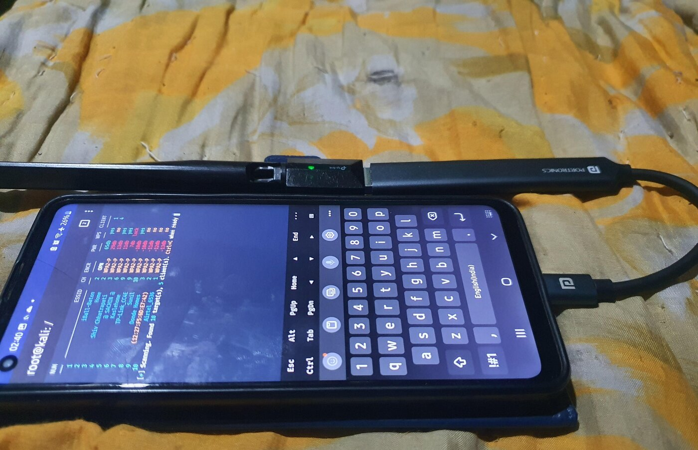

# a21s-88x2bu-driver

Out-of-tree **88x2bu** (RTL8812BU / RTL8821BU) USB Wi-Fi driver, cross-compiled for a **rooted Samsung Galaxy A21s (SM-A217F)** against Samsung's official open-source kernel source and the AOSP Clang toolchain.

> ⚠️ This is an unofficial, community build for a rooted device. Rooting, flashing, and running out-of-tree kernel modules can introduce security risks or render a device unusable. Use at your own risk.

---

## Research Pipeline

```text
CURRENT RESEARCH
       ↓
01  Device Identification
       ↓
02  Samsung Kernel Identification
       ↓
03  Toolchain Investigation
       ↓
04  Driver Selection
       ↓
05  Kernel Build
       ↓
06  88x2bu Build
       ↓
07  Physical A21s Verification
       ↓
08  Evidence / Screenshots
       ↓
09  Reproducibility
```

### 01 — Device Identification

Extracted the exact device and kernel fingerprint using `adb shell getprop` and `uname`, including:

* Model: `SM-A217F`
* Kernel version: `4.19.132-24202344`
* Build incremental: `A217FXXSCDXE2`
* Security patch: `2024-05-01`
* Architecture: `aarch64`

### 02 — Samsung Kernel Identification

Sourced the Samsung open-source kernel release corresponding to the target Galaxy A21F/A217F firmware and kernel configuration from Samsung's Open Source Release Center.

The selected source was used as the kernel build environment for the out-of-tree module.

### 03 — Toolchain Investigation

Inspected the Samsung kernel source tree for `CLANG_VERSION`, `CLANG_TRIPLE`, and `CROSS_COMPILE` definitions and cross-checked those findings against the compiler fingerprint reported by the running kernel in `/proc/version`.

The running kernel reports:

```text
Android clang version 9.0.3
based on r353983c
```

The Samsung kernel source contains the corresponding AArch64 build configuration references:

```text
CLANG_VERSION=clang-r353983c
CLANG_TRIPLE=aarch64-linux-gnu-
CROSS_COMPILE=aarch64-linux-android-
```

The source tree also references the AArch64 Android GCC 4.9 cross-compiler:

```text
aarch64-linux-android-4.9
```

Based on this evidence, the build environment used:

* AOSP Clang `9.0.3 / r353983c`
* `aarch64-linux-gnu-` Clang target triple
* `aarch64-linux-android-4.9`
* `aarch64-linux-android-` cross-compile prefix

### 04 — Driver Selection

Selected the `88x2bu-20210702` out-of-tree driver source for the target RTL8812BU/RTL8821BU-class USB Wi-Fi chipset.

Monitor-mode capability was one of the requirements of the project, and the selected driver was subsequently tested on the physical Galaxy A21s.

### 05 — Kernel Build

Built the Samsung kernel source using:

```text
exynos3830-a217f_defconfig
```

with the identified AArch64 toolchain.

The resulting kernel build environment produced:

* `arch/arm64/boot/Image`
* `vmlinux`
* `Module.symvers`

These artifacts were then used for the out-of-tree module build.

### 06 — 88x2bu Build

Cross-compiled the 88x2bu driver against the Samsung kernel source/build tree using:

* `ARCH=arm64`
* AOSP Clang `r353983c`
* `CLANG_TRIPLE=aarch64-linux-gnu-`
* `CROSS_COMPILE=aarch64-linux-android-`
* `KSRC=` pointing to the Samsung kernel tree

The build produced:

```text
88x2bu.ko
```

### 07 — Physical A21s Verification

The resulting module was transferred to the physical rooted Galaxy A21s and loaded using:

```bash
adb push 88x2bu.ko /data/local/tmp/
adb shell su -c "insmod /data/local/tmp/88x2bu.ko"
```

Verification included:

* Kernel `dmesg` output
* `modinfo`
* USB adapter detection
* Network interface visibility
* Monitor-mode activation
* Wireless capability testing

### 08 — Evidence / Screenshots

Captured proof at the relevant verification stages, including:

* USB adapter detection
* Kernel module loading
* `modinfo`
* Adapter power/activity
* Monitor-mode activation
* Monitor-mode confirmation
* Packet capture/injection capability testing

### 09 — Reproducibility

Packaged the research into this repository with:

* Device and kernel identification
* Toolchain investigation
* Build commands
* Build scripts
* Source/patch documentation
* Verification evidence
* GPL-2.0 licensing
* Reproducibility-oriented documentation

The repository does not vendor the full Samsung kernel source or the upstream 88x2bu source tree.

---

## Result

The project produced an out-of-tree `88x2bu.ko` module targeting the Samsung Galaxy A21s configuration documented below.

The resulting module was subsequently tested on the physical device. The repository contains visual evidence covering USB detection, module loading, module information, monitor-mode operation, and wireless capability testing.

### Target configuration

| Field                | Value                        |
| -------------------- | ---------------------------- |
| Device               | Samsung Galaxy A21s          |
| Model                | `SM-A217F`                   |
| SoC                  | Exynos 3830                  |
| Kernel               | `4.19.132-24202344`          |
| Build incremental    | `A217FXXSCDXE2`              |
| Security patch       | `2024-05-01`                 |
| Defconfig            | `exynos3830-a217f_defconfig` |
| Architecture         | `aarch64 (arm64)`            |
| Clang                | `9.0.3` (`r353983c`)         |
| Clang triple         | `aarch64-linux-gnu-`         |
| Cross compiler       | `aarch64-linux-android-4.9`  |
| Cross-compile prefix | `aarch64-linux-android-`     |

---

## Device Information

| Field             | Value                        |
| ----------------- | ---------------------------- |
| Device            | Samsung Galaxy A21s          |
| Model             | `SM-A217F`                   |
| SoC               | Exynos 3830                  |
| Kernel version    | `4.19.132-24202344`          |
| Build incremental | `A217FXXSCDXE2`              |
| Security patch    | `2024-05-01`                 |
| Defconfig         | `exynos3830-a217f_defconfig` |
| Architecture      | `aarch64 (arm64)`            |

<details>
<summary>Raw <code>adb</code> output</summary>

```text
$ adb shell 'uname -a'
Linux kali 4.19.132-24202344 #1 SMP PREEMPT Tue May 14 14:47:01 +07 2024 aarch64

$ adb shell 'uname -r'
4.19.132-24202344

$ adb shell 'cat /proc/version'
Linux version 4.19.132-24202344 (dpi@VPDJR204) (Android (5484270 based on r353983c)
clang version 9.0.3 (https://android.googlesource.com/toolchain/clang
745b335211bb9eadfa6aa6301f84715cee4b37c5)
(https://android.googlesource.com/toolchain/llvm
60cf23e54e46c807513f7a36d0a7b777920b5881) (based on LLVM 9.0.3svn)) #1 SMP PREEMPT
Tue May 14 14:47:01 +07 2024

$ adb shell 'getprop ro.product.model'
SM-A217F

$ adb shell 'getprop ro.build.version.incremental'
A217FXXSCDXE2

$ adb shell 'getprop ro.build.version.security_patch'
2024-05-01
```

</details>

---

## Toolchain

The toolchain was selected by comparing the running kernel's compiler fingerprint with the build configuration references present in the Samsung kernel source.

| Component            | Value                       |
| -------------------- | --------------------------- |
| Clang                | `9.0.3` (`r353983c`)        |
| Clang triple         | `aarch64-linux-gnu-`        |
| Cross compiler       | `aarch64-linux-android-4.9` |
| Cross-compile prefix | `aarch64-linux-android-`    |

The relevant kernel-source configuration references were identified with:

```bash
grep -rhsE '^(CLANG_VERSION|CLANG_TRIPLE|CROSS_COMPILE) *[:?+]?=' \
  build.config* Makefile 2>/dev/null | sort -u
```

Relevant AArch64 entries included:

```text
CLANG_TRIPLE=aarch64-linux-gnu-

CLANG_VERSION=clang-r353983c

CROSS_COMPILE=aarch64-linux-android-

../PLATFORM/prebuilts/gcc/linux-x86/aarch64/aarch64-linux-android-4.9/bin/aarch64-linux-android-
```

The Samsung source tree contains other toolchain references as well. Those were treated as source-tree references for other build contexts rather than automatically assumed to be the compiler configuration of the running A21s kernel.

---

## Repository Layout

```text
a21s-88x2bu-driver/
├── README.md
├── LICENSE                  # GPL-2.0
├── docs/
│   └── device-info.md       # raw device information
├── scripts/
│   ├── env.sh               # toolchain/environment variables
│   ├── build-kernel.sh
│   └── build-module.sh
└── patches/                 # source patches, if required
```

The full Samsung kernel source and the upstream 88x2bu driver source are **not vendored in this repository**. They are obtained from their respective upstream locations as described below.

Only the project's build scripts, documentation, patches, and supporting files are maintained here.

---

## 1. Get the Sources

### Samsung Kernel Source

The Samsung kernel source was obtained from the official Samsung Open Source Release Center:

[Samsung Open Source Release Center — A217F search](https://opensource.samsung.com/uploadSearch?searchValue=A217F)

The source archive used for this research corresponds to the target Galaxy A21F/A217F firmware and kernel configuration documented in this repository.

The target firmware/build information is:

```text
A217FXXSCDXE2
Security patch: 2024-05-01
```

### 88x2bu Driver Source

The driver source used for this project:

```bash
git clone https://github.com/morrownr/88x2bu-20210702.git
```

This repository is the upstream source selected for the 88x2bu driver used in this project.

---

## 2. Set Up the Toolchain

### AOSP Clang

The Clang toolchain used for the build corresponds to the `r353983c` revision identified from the running kernel and Samsung source configuration.

The local build environment used:

```bash
git clone https://github.com/kclinx/android_prebuilts_clang_host_linux-x86_clang-r353983c.git \
  /opt/toolchains/aosp-clang/clang-r353983c
```

> The repository above is a mirror of the AOSP Clang prebuilt. The compiler itself corresponds to the AOSP `clang-r353983c` toolchain identified during the research.

### AArch64 Android GCC 4.9

The AArch64 Android GCC cross-compiler was obtained from the AOSP prebuilt repository:

```bash
git clone \
  https://android.googlesource.com/platform/prebuilts/gcc/linux-x86/aarch64/aarch64-linux-android-4.9 \
  /opt/toolchains/aarch64-linux-android-4.9
```

Set the cross-compiler directory in `PATH`:

```bash
export PATH="/opt/toolchains/aarch64-linux-android-4.9/bin:$PATH"
```

---

## 3. Build the Samsung Kernel

Enter the extracted Samsung kernel source:

```bash
cd samsung-fullbuild-a217f
```

Generate the target configuration:

```bash
make ARCH=arm64 \
  CC=/opt/toolchains/aosp-clang/clang-r353983c/bin/clang \
  CLANG_TRIPLE=aarch64-linux-gnu- \
  CROSS_COMPILE=aarch64-linux-android- \
  exynos3830-a217f_defconfig
```

Build the kernel:

```bash
make ARCH=arm64 \
  CC=/opt/toolchains/aosp-clang/clang-r353983c/bin/clang \
  CLANG_TRIPLE=aarch64-linux-gnu- \
  CROSS_COMPILE=aarch64-linux-android- \
  KCFLAGS="-Wno-unknown-warning-option -Wno-error" \
  EXTRA_CFLAGS="-Wno-unknown-warning-option -Wno-error" \
  -j"$(nproc)"
```

### Verify the Kernel Build

```bash
ls -la arch/arm64/boot/Image
ls -la Module.symvers
ls -la vmlinux
```

These build artifacts are used as part of the kernel environment required for the out-of-tree module build.

---

## 4. Build the 88x2bu Module

Enter the driver source:

```bash
cd 88x2bu-20210702
```

Clean the previous build:

```bash
make clean
```

Build the module against the Samsung kernel tree:

```bash
make \
  ARCH=arm64 \
  CC=/opt/toolchains/aosp-clang/clang-r353983c/bin/clang \
  CLANG_TRIPLE=aarch64-linux-gnu- \
  CROSS_COMPILE=aarch64-linux-android- \
  KSRC=/mnt/disk2/a21s-kernel/samsung-fullbuild-a217f \
  KCFLAGS="-Wno-unknown-warning-option -Wno-parentheses-equality -Wno-error" \
  EXTRA_CFLAGS="-Wno-unknown-warning-option -Wno-parentheses-equality -Wno-error" \
  -j"$(nproc)"
```

The build produces:

```text
88x2bu.ko
```

The warning-related flags above were part of the compatibility adjustments used during this specific build and should not be interpreted as universally required for every kernel or driver version.

---

## 5. Install and Verify on the Physical Device

Inspect the module before transferring it:

```bash
modinfo 88x2bu.ko
```

Transfer the module:

```bash
adb push 88x2bu.ko /data/local/tmp/
```

Load it through root:

```bash
adb shell su -c "insmod /data/local/tmp/88x2bu.ko"
```

Inspect kernel messages:

```bash
adb shell dmesg | tail -50
```

Check network interfaces:

```bash
adb shell ip link
```

The repository's proof-of-work section contains screenshots from the physical-device verification process.

---

## Releases

Prebuilt `.ko` binaries are **not committed directly to the source tree**.

When released, a prebuilt module should be attached to a GitHub Release corresponding to the exact target kernel/build configuration.

Example release tag:

```text
v1.0-A217FXXSCDXE2
```

The module is tied to the kernel configuration against which it was built. A module built for one kernel/build configuration is not automatically guaranteed to load on another kernel or firmware version.

Always verify the release target against the device's kernel and build information before attempting to load the module.

---

## License

This project is licensed under the **GNU General Public License v2.0**. See [`LICENSE`](LICENSE).

The Linux kernel and the selected 88x2bu driver source are GPLv2-licensed projects.

The Samsung kernel source is not redistributed in this repository; the repository references Samsung's official Open Source Release Center instead.

---

## Credits

* [Samsung Open Source Release Center](https://opensource.samsung.com/) — official Samsung kernel source
* [morrownr/88x2bu-20210702](https://github.com/morrownr/88x2bu-20210702) — 88x2bu driver source
* [kclinx/android_prebuilts_clang_host_linux-x86_clang-r353983c](https://github.com/kclinx/android_prebuilts_clang_host_linux-x86_clang-r353983c) — mirror of the AOSP Clang prebuilt used in this build
* AOSP `aarch64-linux-android-4.9` prebuilt GCC toolchain

---

## Disclaimer

Rooting, flashing, and running out-of-tree kernel modules can brick a device, cause data loss, introduce security risks, or otherwise affect device operation.

This repository is provided for educational and personal research purposes only, without warranty.

---

## Proof of Working Build

The following evidence was captured during testing on the physical Samsung Galaxy A21s.

### USB Adapter Detection



### Kernel Module Loaded



### Module Information



### Adapter Power / Activity



### Monitor Mode



### Monitor Mode Confirmation



### Wireless Capability Testing


